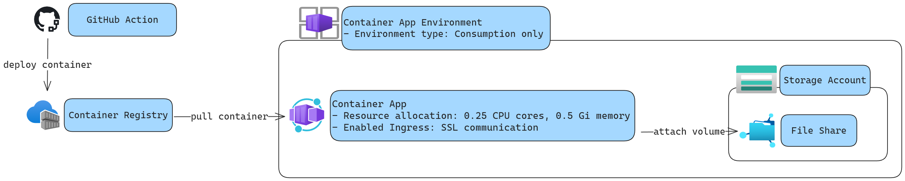

# Introduction

I have chosen the Azure Container Apps (ACA) over the Azure Container Instance (ACI) for the following:

- It has a consumption-based only environment which is good for infrequent jobs. The replicas can be scaled down to zero so that unused instances are inactivated automatically.
- It provides ingress for the application out of the box in order to configure the secure connection.
- It is also possible to create scheduled tasks using **Container App Job** resource.

## Architecture Diagram



# Prerequisites

You need to have the following resources in Azure:

- **Container registry**: The registry to store the docker images.
- **Container App**: The place where the application will be deployed.
- **Container Apps Environment**: It is created during the **Container App** creation. Use a consumption-based environment to reduce the cost.
- **Storage account**: To attach a volume to the container application, you need to create a **Files shares** under the storage account.

## Register Azure File share

Create a 1 TiB file share with "TransactionOptimized" access tier using Azure CLI:

```bash
az storage share-rm create --resource-group $resourceGroupName --storage-account $storageAccountName --name $shareName --access-tier "TransactionOptimized" --quota 1024 --output none
```

Select your **Container Apps Environment** and register the already created file share:

- Go to the **Azure Files** tab under the **Settings** section.
- Click on <kbd>+ Add</kbd> button and fill out the information.

> Note: You will need an access key which is under the **Access keys** tab under your storage account.

Next, visit your **Container App** resource, go to the **Volumes** tab, and then add a new volume:

- Select the "Azure file volume" as the **Volume type**.
- Give a **Name** for the volume.
- Select the **File share**.
- Provide a [Mount options](https://learn.microsoft.com/en-us/troubleshoot/azure/azure-kubernetes/storage/mountoptions-settings-azure-files) e.g. `file_mode=0777` to read, write, and execute files.

# Local Development

Use the `cargo run` command for the most verbose debugging capabilities. Optionally, append the environment variables before it to test environment variables:

```bash
USER=user_test PASSWORD=password_test SECRET=secret_test cargo run
```

Test the release version with:

```bash
cargo build --release
./target/release/azure-container-deployment
```

Build the docker image:

```bash
docker build -t rocket-webservice .
```

Run the docker image:

```bash
docker run -p 80:80 rocket-webservice
```

You can add the `-e USER=my_user -e PASSWORD=my_password -e SECRET=my_secret` options, too.

# Manual Deployment

The following steps show how to build and push docker images to the Azure Container Registry (ACR) and deploy that image to the Azure Container Apps (ACA).

## Push Image to ACR

Start the docker engine and then log in to the container registry:

```bash
docker login <login_server>.azurecr.io
```

You can get the login URI and credentials from the **Access Keys** tab. Next, push the local image to the registry:

```bash
docker tag rocket-webservice <login_server>.azurecr.io/rocket-webservice:v0.0.1
docker push <login_server>.azurecr.io/rocket-webservice:v0.0.1
```

Pull the images with this command:

```bash
docker pull <login_server>.azurecr.io/rocket-webservice:v0.0.1
```

## Create a New Revision in ACA

Once the new image version is pushed to the ACR, you can create a new app version to use the new image:

- Select your **Container App** and go to the **Revisions and replicas** under the **Application** section.
- Click on the <kbd>Create new revision</kbd> button.
- Under the **Container image** section, select the right container or create a new one if it does not exist.
- Fill the details under the **Basics** section such as **Name**, **Registry**, **Image**, **Image tag**, **Environment variables**, etc.
- Optionally, you can attach a volume under the **Volume mounts** section. If you can not select a volume, you need to [register a file share under the Container Apps Environment](#register-azure-file-share) resource, first. After that, set the `/tmp` as the mount path.

> Note: To create a secret, go to the **Secrets** tab under the **Settings** section. Then click on the <kbd>+ Add</kbd> button.

# Automatic Deployment

The [azure-container-apps-build-and-deploy](https://github.com/marketplace/actions/azure-container-apps-build-and-deploy) GitHub action is used for automatic deployment. Before this action, Azure and Docker login is required with proper credentials. See how to [Configure GitHub workflow](https://learn.microsoft.com/en-us/azure/container-instances/container-instances-github-action#configure-github-workflow) using Azure CLI.

> Note: The `acrName` or `registryUrl` arguments are required because we are building and pushing the docker image to ACR.
